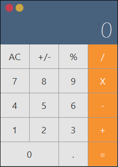

# Anwar

A desktop calculator application built with **Java 21**, **JavaFX 21**, and **Maven**.



## Features

- Desktop calculator UI
- JavaFX-based interface
- Java 21
- Maven build system
- Windows application packaging with `jpackage`
- Bundled Java runtime for distribution

## Requirements

- Java 21+
- Maven 3.9+
- Windows 10/11 for Windows packaging

Check your Java version:

```bash
java -version
```

Check Maven:

```bash
mvn -version
```

## Technology

- **Java 21**
- **JavaFX 21**
- **Maven**
- **jpackage**

## Project Status


## Build

Build the project with Maven:

```bash
mvn clean package
```

The application JAR will be generated as:

```text
target/anwar.jar
```

## Run During Development

Run the JavaFX application using the JavaFX Maven plugin:

```bash
mvn javafx:run
```

This is the recommended way to run the application during development.

## Windows Application

JavaFX applications should not be distributed as a plain executable JAR because JavaFX requires its runtime modules and platform-specific native libraries.

For Windows distribution, use `jpackage`.

First build the project:

```bash
mvn clean package
```

Then create a Windows application image:

```powershell
jpackage `
  --input target `
  --name Anwar `
  --main-jar anwar.jar `
  --main-class com.rafsanjani.anwar.MainApp `
  --type app-image `
  --dest dist
```

This creates:

```text
dist/
└── Anwar/
    ├── Anwar.exe
    └── runtime/
```

Run the application:

```powershell
.\dist\Anwar\Anwar.exe
```

The bundled runtime means the target computer does not need a separate Java installation.

## Create Windows Installer

To create a Windows `.exe` installer:

```powershell
jpackage `
  --input target `
  --name Anwar `
  --main-jar anwar.jar `
  --main-class com.rafsanjani.anwar.MainApp `
  --type exe `
  --dest dist
```

The installer will be generated inside:

```text
dist/
```

## Development

Clone the repository and enter the project directory:

```bash
git clone <repository-url>
cd Anwar-JavaFX-Calculator
```

Build:

```bash
mvn clean package
```

Run:

```bash
mvn javafx:run
```

## License

This project is licensed under the MIT License. See the [LICENSE](LICENSE) file for details.